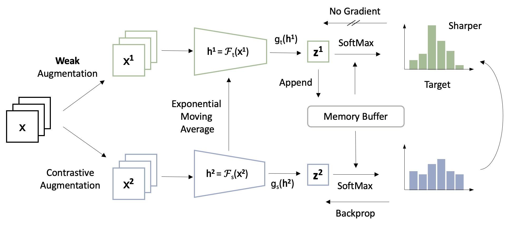

# ReSSL: Relational Self-Supervised Learning with Weak Augmentation

This repository contains PyTorch evaluation code, training code and pretrained models for ReSSL.

For details see [ReSSL: Relational Self-Supervised Learning with Weak Augmentation](https://arxiv.org/abs/2107.09282) by Mingkai Zheng, Shan You, Fei Wang, Chen Qian, Changshui Zhang, Xiaogang Wang and Chang Xu

